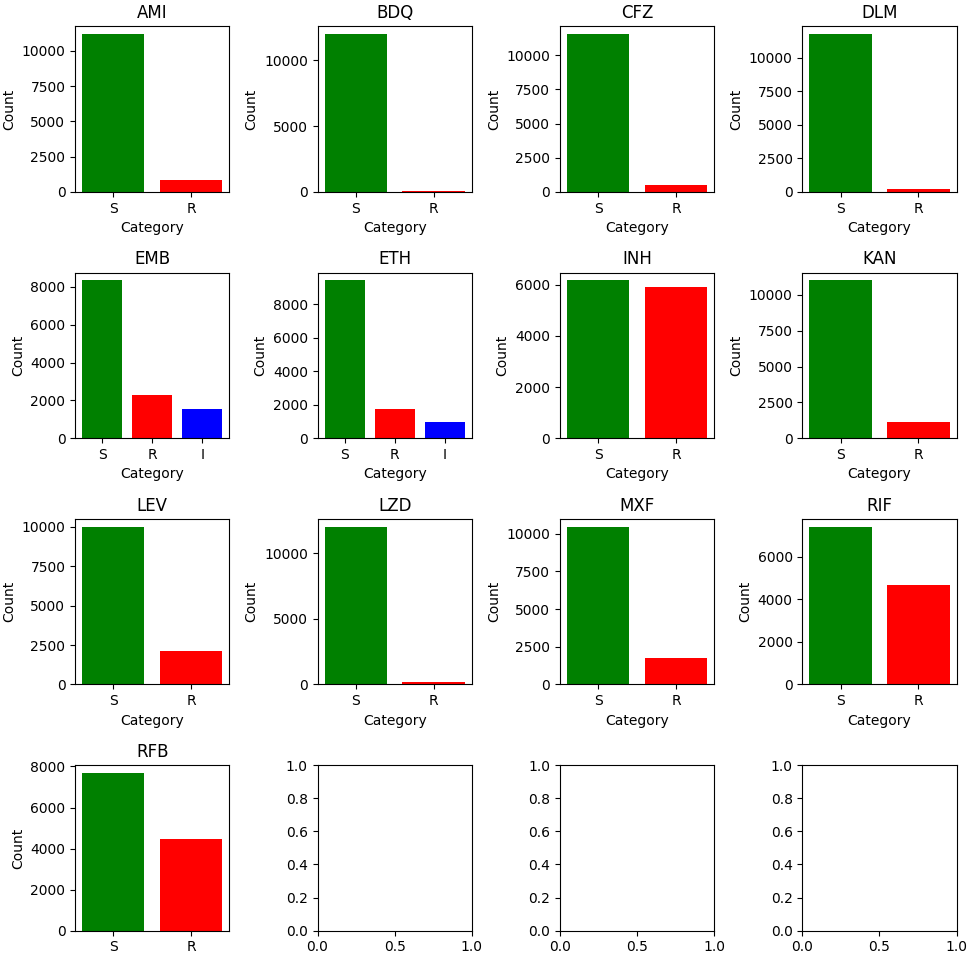

# AMR Prediction

We are predicting the antimicrobial resistance (AMR) of Mycobacterium tuberculosis using machine learning.

## Description

We use logistic regression with feature selection to predict the AMR of Mycobacterium tuberculosis. The data is obtained from the CRyPTIC project.

## Drug Susceptibility Data

Below is a table representing the susceptibility data for various drugs:

| Drug | S (Susceptible) | R (Resistant) | I (Intermediate) | TTL (Total) |
|------|-----------------|---------------|------------------|-------------|
| AMI  | 11188           | 882           | 0                | 12070       |
| BDQ  | 11957           | 109           | 0                | 12066       |
| CFZ  | 11522           | 525           | 0                | 12047       |
| DLM  | 11739           | 186           | 0                | 11925       |
| EMB  | 8336            | 2261          | 1559             | 12156       |
| ETH  | 9431            | 1727          | 972              | 12130       |
| INH  | 6161            | 5907          | 0                | 12068       |
| KAN  | 11008           | 1120          | 0                | 12128       |
| LEV  | 10016           | 2145          | 0                | 12161       |
| LZD  | 12031           | 156           | 0                | 12187       |
| MXF  | 10468           | 1724          | 0                | 12192       |
| RIF  | 7414            | 4683          | 0                | 12097       |
| RFB  | 7684            | 4464          | 0                | 12148       |

## Graphical Representation

Below is a graphical representation of the data:

## External Resources

For data, visit [CRyPTIC June 2022 Release](https://ftp.ebi.ac.uk/pub/databases/cryptic/release_june2022/).